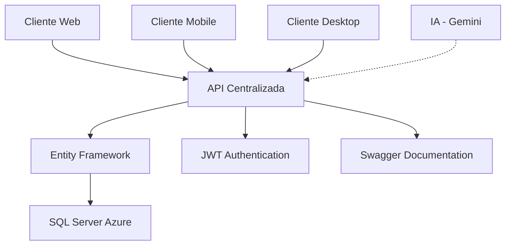
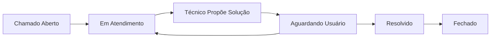

# 🚀 API Centralizada de Suporte Técnico

Esta é uma **API REST centralizada** desenvolvida em C# (.NET 8.0) que integra **três sistemas** em uma única solução, conectando-se a um **banco de dados SQL Server** hospedado no Azure. A API gerencia um sistema completo de suporte técnico com usuários, técnicos e histórico de atendimento.

## 🎯 Visão Geral da Arquitetura Centralizada

A API centraliza **três sistemas principais**:

### 1. **Sistema de Usuários** 👥
- Gerenciamento de colaboradores, técnicos e administradores
- Sistema de permissões hierárquico (3 níveis)
- Autenticação JWT segura com BCrypt

### 2. **Sistema de Chamados** 🎫
- Gestão completa de tickets de suporte
- Prioridades e status configuráveis
- Atribuição automática de técnicos
- Rastreamento de tempo de resolução
- Sugestões de solução por técnicos
- Integração com IA para sugestões de solução

### 3. **Sistema de Histórico** 📝
- Log completo de todas as interações
- Suporte a mensagens de IA
- Auditoria de mudanças
- Timeline de eventos

## 🏗️ Arquitetura Centralizada

### **Principais Vantagens:**
- ✅ **Fonte Única de Dados**: Um banco, uma API, múltiplos sistemas
- ✅ **Consistência**: Dados sempre sincronizados
- ✅ **Manutenibilidade**: Código centralizado e organizado
- ✅ **Escalabilidade**: Fácil adição de novos sistemas
- ✅ **Segurança**: Autenticação e autorização centralizadas

## 🏗️ Arquitetura Técnica

### **Modelos de Dados Centralizados**

| Modelo | Descrição | Relacionamentos |
|--------|-----------|-----------------|
| **Usuario** | Gestão de usuários com 3 níveis de permissão | 1:N com Chamados (Solicitante/Técnico) |
| **Chamado** | Tickets de suporte com status e prioridades | N:1 com Usuario, 1:N com HistoricoChamado |
| **HistoricoChamado** | Log de todas as interações e mensagens | N:1 com Chamado, N:1 com Usuario |

### **Stack Tecnológica**

| Tecnologia | Versão | Propósito |
|------------|--------|-----------|
| **.NET 8.0** | Latest | Framework principal |
| **Entity Framework Core** | 8.0.0 | ORM para acesso ao banco |
| **SQL Server** | Azure | Banco de dados centralizado |
| **JWT Bearer** | 8.0.0 | Autenticação segura |
| **BCrypt** | 4.0.3 | Hash de senhas |
| **Swagger** | 6.5.0 | Documentação automática |

### **Fluxo de Dados Centralizado**



### **Fluxo de Solução de Chamados**


## 🚀 Pré-requisitos

Antes de executar a aplicação, certifique-se de ter instalado:

- [.NET 8.0 SDK](https://dotnet.microsoft.com/download/dotnet/8.0)
- [Visual Studio 2022](https://visualstudio.microsoft.com/pt-br/downloads/) ou [Visual Studio Code](https://code.visualstudio.com/)
- [SQL Server Management Studio (SSMS)](https://docs.microsoft.com/en-us/sql/ssms/download-sql-server-management-studio-ssms) (opcional, para gerenciar o banco)

## 📦 Dependências do Projeto

### Pacotes NuGet Principais

| Pacote | Versão | Descrição |
|--------|--------|-----------|
| `Microsoft.EntityFrameworkCore.SqlServer` | 8.0.0 | Provider SQL Server para Entity Framework |
| `Microsoft.EntityFrameworkCore.Tools` | 8.0.0 | Ferramentas para migrations e scaffolding |
| `Azure.Identity` | 1.12.1 | Autenticação com Azure Active Directory |
| `Swashbuckle.AspNetCore` | 6.5.0 | Geração automática de documentação Swagger |
| `Microsoft.AspNetCore.OpenApi` | 8.0.0 | Suporte a OpenAPI 3.0 |
| `BCrypt.Net-Next` | 4.0.3 | Hash de senhas |
| `Microsoft.AspNetCore.Authentication.JwtBearer` | 8.0.0 | Autenticação JWT |

### Configuração de Conexão

A API está configurada para conectar com um banco SQL Server no Azure usando autenticação do Azure Active Directory:

```json
{
  "ConnectionStrings": {
    "AzureSql": "Server=tcp:rg-minha-api.database.windows.net,1433;Initial Catalog=MinhaApiDB;Encrypt=true;TrustServerCertificate=false;Connection Timeout=30;Authentication=Active Directory Default;"
  }
}
```

## 🛠️ Instalação e Configuração

### Passo 1: Clonar o Repositório

```bash
git clone <url-do-repositorio>
cd ApiParaBD
```

### Passo 2: Restaurar Dependências

```bash
dotnet restore
```

### Passo 3: Configurar String de Conexão

1. Abra o arquivo `appsettings.json`
2. Atualize a string de conexão `AzureSql` com os dados do seu banco Azure:
   - Substitua `rg-minha-api.database.windows.net` pelo seu servidor
   - Substitua `MinhaApiDB` pelo nome do seu banco de dados

### Passo 4: Executar Migrations (se necessário)

```bash
# Criar uma nova migration
dotnet ef migrations add NomeDaMigration

# Aplicar migrations ao banco
dotnet ef database update
```

### Passo 5: Executar a Aplicação

```bash
dotnet run
```

A API estará disponível em:
- **HTTPS**: `https://localhost:7000`
- **HTTP**: `http://localhost:5000`
- **Swagger UI**: `https://localhost:7000/swagger`

## 📚 Endpoints da API Centralizada

### 🔐 **Autenticação**
- **POST** `/api/Auth/login` - Login com JWT token
  - Retorna token JWT válido por 8 horas
  - Suporte a diferentes níveis de permissão

### 👥 **Sistema de Usuários**
- **GET** `/api/Usuarios` - Lista todos os usuários
- **GET** `/api/Usuarios/{id}` - Busca usuário por ID
- **POST** `/api/Usuarios` - Cria novo usuário

### 🎫 **Sistema de Chamados**
- **GET** `/api/Chamados` - Lista todos os chamados
- **GET** `/api/Chamados/{id}` - Busca chamado por ID
- **POST** `/api/Chamados` - Cria novo chamado
- **PUT** `/api/Chamados/{id}` - Atualiza chamado, incluindo propostas de solução

### 📝 **Sistema de Histórico**
- Integrado automaticamente com chamados
- Suporte a mensagens de IA
- Auditoria completa de interações

### **Exemplo de Uso Completo**

```json
// 1. Login
POST /api/Auth/login
{
  "email": "tecnico@empresa.com",
  "senha": "senha123"
}

// 2. Criar Usuário
POST /api/Usuarios
{
  "nome": "João Silva",
  "email": "joao.silva@empresa.com",
  "senha": "senha123",
  "telefone": "(11) 99999-9999",
  "cargo": "Desenvolvedor",
  "permissao": 1
}

// 3. Criar Chamado
POST /api/Chamados
{
  "titulo": "Problema no sistema",
  "descricao": "Sistema não está funcionando",
  "tipo": "Software",
  "solicitanteId": 1,
  "prioridade": 2,
  "solucao": "Reinstale o software e execute a atualização disponível."
}
```

## 🔐 Sistema de Autenticação JWT

A API utiliza **JWT (JSON Web Tokens)** para autenticação segura:

### **Como Funciona:**
1. **Login**: POST `/api/Auth/login` com email/senha
2. **Token**: Recebe JWT válido por 8 horas
3. **Autorização**: Inclui token no header `Authorization: Bearer {token}`
4. **Permissões**: Token contém informações de permissão do usuário

### **Níveis de Permissão:**
- **Colaborador (1)**: Acesso básico aos chamados
- **SuporteTecnico (2)**: Pode atender chamados
- **Administrador (3)**: Acesso total ao sistema

### **Exemplo de Uso:**
```bash
# 1. Fazer login
curl -X POST "https://localhost:7000/api/Auth/login" \
  -H "Content-Type: application/json" \
  -d '{"email": "user@empresa.com", "senha": "senha123"}'

# 2. Usar token nas requisições
curl -X GET "https://localhost:7000/api/Chamados" \
  -H "Authorization: Bearer {seu_token_jwt}"
```

## 🗄️ Estrutura do Banco de Dados

### Tabela: Usuarios
- `Id` (int, PK)
- `Nome` (string, required)
- `Email` (string, required)
- `SenhaHash` (string, required)
- `Telefone` (string, nullable)
- `Cargo` (string, required)
- `Permissao` (enum: Colaborador=1, SuporteTecnico=2, Administrador=3)

### Tabela: Chamados
- `Id` (int, PK)
- `Titulo` (string, required)
- `Descricao` (string, required)
- `DataAbertura` (datetime)
- `DataFechamento` (datetime, nullable)
- `Solucao` (string, nullable) - Solução proposta pelo técnico
- `SolicitanteId` (int, FK para Usuarios)
- `TecnicoResponsavelId` (int, FK para Usuarios, nullable)
- `Prioridade` (enum: Baixa=1, Media=2, Alta=3)
- `Status` (enum: Aberto=1, EmAtendimento=2, AguardandoUsuario=3, Resolvido=4, Fechado=5)
- `Tipo` (string, required)

### Tabela: Historicos
- `Id` (int, PK)
- `Mensagem` (string, required)
- `DataOcorrencia` (datetime)
- `EhMensagemDeIA` (bool, default: false)
- `ChamadoId` (int, FK para Chamados)
- `UsuarioId` (int, FK para Usuarios, nullable)

## 🧪 Testando a API

### Usando Swagger UI
1. Acesse `https://localhost:7000/swagger`
2. Explore os endpoints disponíveis
3. Teste as operações diretamente na interface

### Usando HTTP Client
```bash
# Health Check
curl -X GET "https://localhost:7000/api/HealthCheck"

# Listar usuários
curl -X GET "https://localhost:7000/api/Usuarios"
```

## 🔧 Desenvolvimento

### Adicionando Novos Endpoints

1. Crie um novo controller na pasta `Controllers/`
2. Herde de `ControllerBase`
3. Use o atributo `[ApiController]` e `[Route("api/[controller]")]`
4. Injete o `AppContext` no construtor

### Exemplo de Controller

```csharp
[ApiController]
[Route("api/[controller]")]
public class MeuController : ControllerBase
{
    private readonly AppContext _context;

    public MeuController(AppContext context)
    {
        _context = context;
    }

    [HttpGet]
    public async Task<IActionResult> Get()
    {
        // Sua lógica aqui
        return Ok();
    }
}
```

## 🚨 Troubleshooting

### Problemas Comuns

1. **Erro de Conexão com Azure SQL**
   - Verifique se a string de conexão está correta
   - Confirme se o firewall do Azure permite sua IP
   - Verifique se as credenciais do Azure AD estão corretas

2. **Erro 404 nos Endpoints**
   - Verifique se o controller está registrado corretamente
   - Confirme se a rota está mapeada no `Program.cs`

3. **Problemas com Migrations**
   - Execute `dotnet ef database update` para aplicar migrations pendentes
   - Verifique se o banco de dados existe e está acessível

### Logs e Debug

Para habilitar logs detalhados, modifique o `appsettings.Development.json`:

```json
{
  "Logging": {
    "LogLevel": {
      "Default": "Debug",
      "Microsoft.EntityFrameworkCore": "Information"
    }
  }
}
```

## 🤝 Contribuição

1. Faça um fork do projeto
2. Crie uma branch para sua feature (`git checkout -b feature/AmazingFeature`)
3. Commit suas mudanças (`git commit -m 'Add some AmazingFeature'`)
4. Push para a branch (`git push origin feature/AmazingFeature`)
5. Abra um Pull Request

## 📄 Licença

Este projeto está sob a licença MIT. Veja o arquivo `LICENSE` para mais detalhes.

## 📞 Suporte

Para suporte e dúvidas:
- Abra uma issue no repositório
- Entre em contato com a equipe de desenvolvimento
- Consulte a documentação do .NET: https://docs.microsoft.com/pt-br/dotnet/

